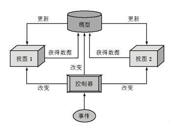
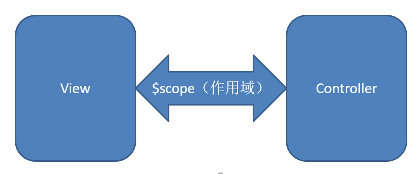

Angular

## Angular与jQuery

- jQuery : 库
  + 提供了一些已有的方法 可以用来调用
  + `$('.test').val()`
- Angular : 框架
  + 框架提供了一种结构或模式
  + 我们按照这种结构书写代码
  + 框架来完成剩下的事

### 什么是SPA

- single page application
- 单页应用程序

### angular指令

 - 在angular中以ng-开头的标签属性称之为指令
 - ng-app : 选择angular管理哪部分代码,管理的是ng-app所在的元素及其子元素
 - ng-click : 用来注册点击事件
 - ng-model : 可以指定一个属性值,这个属性值代表当前元素的value值 有value属性的元素才可以使用
 - ng-init :可以对数据进行初始化操作,给一个默认值

### AngularJS 表达式

- angularjs使用表达式把数据绑定到html
- 表达式使用双花括号{{expression}}
- 表达式内可以包含字符串、运算符和变量


### 模块

- 创建模块`angular-module('模块名',['$scope',function($scope){}])`
- 想要改变页面上{{name}}的值 可以直接改变$scope.name的值
- *需要显示模型数据的值需要给父元素或这个标签添加ng-controller指令*

### 双向数据绑定

- 比如使用`ng-model`指令绑定一个数据模型`$scope.text` 当`$scope.text`改变的时候页面上绑定这个指令的元素的value值也会随之改变 当这个元素的value值改变的时候对应的数据模型也发生了改变
- 这种相互影响的关系就称为双向数据绑定

### MVC思想

- Model : 存储 获取数据
- View : 视图 用户可以看到的数据
- Controller : 控制器 做一些控制和调度的操作 



### $scope

- 视图与控制器之间的数据桥梁

- 用来在视图和控制器之间传递数据

- 用来暴露数据模型(数据,行为)

  

  ​

### MVVM

- ViewModel : 视图模型
- $scope就是所谓的视图模型
- 在AngularJS中$scope 的大量使用甚至超过了Controller(控制器的概念),所以AngularJS也可称为MVVM框架

### AngularJS中划分模块的方式

- 1.按照项目的功能划分
- 2.按照项目中文件的类型去划分魔抗

### AngularJS创建控制器的三种方法

 -  传统方式创建

    ```javascript
        // 创建控制器(1.2.x版本)
        // angular会把全局的函数当作控制器
        function demoController($scope){
          $scope.name = '小明'
        }

        function xxx($scope){
          $scope.age = 18
        }
    ```

- 面向对象方式创建控制器

  ````html
  <!-- 这里的obj 代表控制器中回调函数new 出的对象 -->
  <div ng-controller="demoController as obj">
    <p>{{myname}}</p>
    <p>{{obj.name}}</p>
  </div>
  ````

  ````javascript
  // 1.创建模块
      var app = angular.module('myApp', [])

      // 2.创建控制器
      // angular会把这二个参数当作构造函数使用
      app.controller('demoController', function($scope){
        $scope.myname='小红'
        this.name = '小明'
      })
  ````

  ​			

- 安全的方式创建控制器

  - 为了避免代码压缩后无法运行

    ````javascript
     // 把第二个参数改为一个数组,在数组把我们需要的参数的名字写上
        // 回调函数就写在数组的最后一个元素上
        // *注意*：数据中传入的元素的顺序,要和function的中顺序一一对应
        app.controller('demoController',['$scope','$log',function($scope,$log){
          $scope.msg = 'hello World!'
          $log.log('哈哈哈哈！')
        }])
    ````

### 指令

#### ng-bind

- 解决表达式闪烁问题
- `<p ng-bind="msg"></p>`浏览器不会把标签的属性显示出来
- 与表达式效果类似 angularjs会把ng-bind的值渲染到p标签中间 
- 只能在双标签中使用

#### ng-cloak

- 可以解决表达式闪烁问题  
- 在表达式父元素添加上 class="ng-cloak"使用 
- 在渲染时会隐藏表达式 渲染完成后将表达式显示出来

#### ng-repeat

- 把一组数据渲染到页面上

- 类似for in遍历 不会遍历重复的值

  ````html
  <li ng-repeat:"（key，item） in obj">//item代表对象里的值 key代表对象的键
  	//打印键   打印值
  	{{key}}  {{item}}
  </li>
  ````

  *如果是重复值可以在指令后面加上track by $index*

  ##### ng-repeat补充

  - ng-repeat的一些常用值

    ```
    	$odd 为奇数时为true
    	$even 为偶数时为true
    	$first 为第一条时为true
    	$last 为最后一条为true
    	$middle 不是第一条或最后一条时为true
    ```

#### ng-class

- 可以控制类名 

- ng-class{'类名:true'} 对象里的值也可以为表达式

  ```html
      <!--  ng-class,动态的添加class样式,
        以对象的形式书写，angular会把属性值为true的属性名当作样式添加到class
        class="green" -->
      <li ng-class="{red:item.age>=20, green:item.age>=10&&item.age<20,blue:item.age<10}" ng-repeat="item in data">
        {{item.name}},{{item.age}}
      </li>
  ```

#### ng-show ng-hide

- 设置元素的显示与隐藏

- ng-show的值为true时显示元素样式

- ng-hide相反

  ```html
      <!-- ng-show,控制元素的显示或隐藏,值为true时显示，为false隐藏-->
      <p ng-show="isShowing">我是中国人，我爱自己的祖国!</p>
      <!-- ng-hide 值为true时，隐藏当前元素 -->
      <p ng-hide="true">我是小明!</p>
  ```

### ng-if

-  控制元素的显示与否

- 与ng-show的区别是值为false时元素会从结构中移除

  ```html
      <!-- ng-if，也能控制元素的显示或隐藏,为true时显示,为false时【会将当前dom元素移除】 -->
      <p ng-if="true">我是中国人，我爱自己的祖国!</p>
      <h1>ng-if="false"</h1>
      <p ng-if="false">我是中国人，我爱自己的祖国!</p>
  ```

### ng-switch

- 当ng-switch-when等于ng-switch对应值时 当前dom元素就显示

  ```html
      <div ng-switch="name">
        <div ng-switch-when="小明">
          我是小明，我在这里！
        </div>
        <div ng-switch-when="小红">
          我是小红!
        </div>
      </div>
  ```

### 其他常用指令

- ng-checked:
  + 单选/复选是否选中 单项数据绑定 
- ng-selected:
  + 是否选中
- ng-disable:
  + 是否禁用
- ng-readonly:
  + 是否只读

### 常用事件指令

不同于以上的功能性指令，Angular还定义了一些用于和事件绑定的指令：

- ng-blur：失去焦点
- ng-focus： 获得焦点
- ng-change：内容改变
- ng-copy：复制
- ng-click: <div ng-click="aa()"></div>
- ng-dblclick：双击
- ng-submit：  form表单提单

### 指令的其他使用方式

data-xxx,在使用angular指令时，只需要在原先的指令前加上data-前缀。
如: data-ng-app,data-ng-click
x-ng-app,x-ng-click

### $watch 监视数据模型变化

```javascript
    $scope.name = '小明'
      $scope.age = 18

      // $watch可以用来监视数据模型的变化
      // 第一个参数: 数据模型对应的名字(字符串形式)
      // 第二个参数: 相应的数据模型变化就会调用 这个函数
      // 默认会直接执行一次回调函数
      $scope.$watch('name',function(now,old){
        // 第一个参数是变化后的值
        // 第二个参数是变化前的值
        // console.log(now,old)
      })
```
- 也可以监视方法的返回值

  ````javascript
   $scope.getAge = function(){
          return $scope.age
        }
        
        // 也能够监视$scope.属性中的方法的返回值
        $scope.$watch('getAge()',function(now,old){
          console.log(now,old)
        })
  ````

  ​

### 服务

````javascript
var app = angular.module('service',[])
//创建服务模块

//创建服务
//第一参数 服务的名字
//第二个参数的function:
	//angular会把这个function当作构造函数 
app.service('MyService', [function(){
    this.name = '小明'
  }])
````

- 使用服务

  ```javascript
      // 1.创建模块
    var app = angular.module('todosApp', ['service'])
    // 2.创建控制器
    app.controller('todosController', [
      'MyService'
      , function(MyService){
      // 这个MyService就是，对应的'MyService'时的回调函数new出的对象
      console.log(MyService)
  }])
  ```

### 自定义指令

#### 创建自定义指令

- *自定义指令的名字要符合驼峰命名法*

  ````javascript
  //创建自定义指令 第一个参数指令的名字 使用的时候要把大写转换成小写并在前面加上 - my-directive
  //第二个参数跟控制器的第二个参数类似
  angular.module('directiveApp',[]).directive('myDirective',[function(){
    //return 一个对象
    return {
      // template是封装的模板
      template:'<p>一行代码</p>'
    }
  }])
  ````

  ​

#### 自定义指令中回调返回的对象的属性

- template : 需要提供一个字符串 最终会被添加到页面中添加自定义属性的位置

- templateUrl : 需要提供一个html文件路径 angular会发送请求 请求对应的文件 文件内容作为模板插入到自定义指令中间 也可以提供一个script标签的id 要改变script标签的type

- restrict : 设置属性的使用形式 参数为一个字符串

   - A : Attribute 只能以属性的形式使用
  - C : Class 只能以类样式名使用
  - E : Element 只能以自定义标签的形式使用
  - M : 以注释的方式使用 

- replace : 参数为一个布尔值 为true时参数会被用来替换使用自定义指令的外层内容

  ​	*否则是插入到自定义指令中间*

- trasnsclude : 为true时会把调用自定义指令标签的内容插入到模板中

  ​	*拥有ng-transclude 指令的标签中间*

- scope : 传入一个对象 可以用来获取自定义指令的属性值 


  + 给当前对象添加一个属性 以@开头,后面跟上自定义指令的属性名 然后就能到模板中获取对应的属性值
    + `scope:{temp:'@myStyle'}`
    + scope:{myStype:'@'}

- link : 需要传入function function在angular解析到相应指令时会执行一次

  - scope 类似$scope 
  - element : 自定义指令所在标签对应的对象
  - attribute : 自定义指令所在标签相应的属性

### 过滤器(filter)

- 格式化数据
- 过滤数据(filter)

```html
    <ul>
        <!--  如果指定一个布尔值，或者字符串就是全文匹配 -->
      <!-- 会到对应的todos中寻找，如果当前元素有completed属性且值 为true就会被显示出来。（只会到completed属性中寻找） -->
      <li ng-repeat="item in todos | filter : {completed:true} ">
        {{item.name}},{{item.completed}}
      </li>
    </ul>
```

- currency

```html
  <h1>currency</h1>
  <!-- 在数据模型后加上|  再加上过滤器的名字 
        也可以在过滤器名字后指定参数，参数是写在冒号后面的-->
  <p>{{money | currency : '￥'}}</p>

  <h1>date</h1>
  <p>{{myDate | date : 'yyyy年MM月dd日 HH:mm:ss'}}</p>
```

- limitTo

```html
    <h1>limitTo</h1>
  <!-- 第一个参数，表明显示多少个字，第二个参数表示，从第几个字开始显示(索引从0开始) -->
  <p>{{msg | limitTo : 5 : 2}}...</p>
```

- orderBy 及 json

```html
<h1>json</h1>
 <!--  格式化显示json数据，参数指定缩近的长度 -->
 <pre>{{myJson | json : 8}}</pre>
  <h1>orderBy</h1>
  <!-- 对数据进行排序，参数，给+号就按正序排，- 就按倒序排 -->
  <span ng-repeat="item in arr | orderBy:'-'">{{item }}，</span>
```

- 在js中使用过滤器

```javascript
    <!-- $filter 需要在控制器的回调中传入 -->
    // 可以调用不同的过滤器得到相应的结果
      // 参数是一个过滤器的名字
      // 返回值是一个方法
      //        : 第一个参数是需要处理的数据
      //        : 后面的参数是当前过滤器本身需要的参数
     $scope.result =  $filter('currency')($scope.money,'￥')
```

